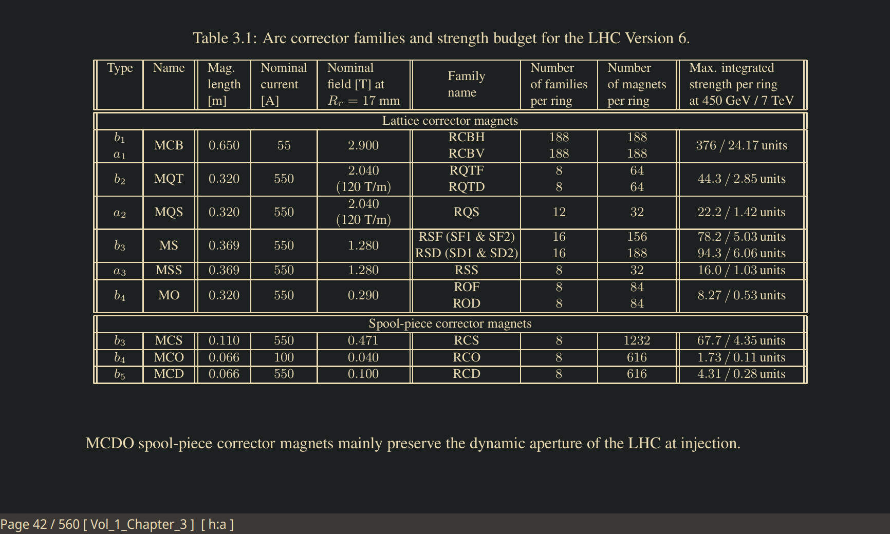

# Base16-sioyek

> See the [Base16 repository](https://github.com/chriskempson/base16) for more information.  
> This theme was built with [Base16 Builder Go](https://github.com/tinted-theming/base16-builder-go).

Base16 colorschemes for the [sioyek](https://github.com/ahrm/sioyek) pdf reader.

<div align="center"><p>Figure 1: Soiyek with gruvbox hard and custom colors enabled</p></div>

# Installation

GIt clone and copy the colorscheme's config file to `$XDG_CONFIG_HOME/sioyek/prefs_user.config`.

```bash
git clone git@github.com:loiccoyle/base16-sioyek.git
cp base16-sioyek/colors/base16-gruvbox-dark-hard.config ~/.config/sioyek/prefs_user.config
```
